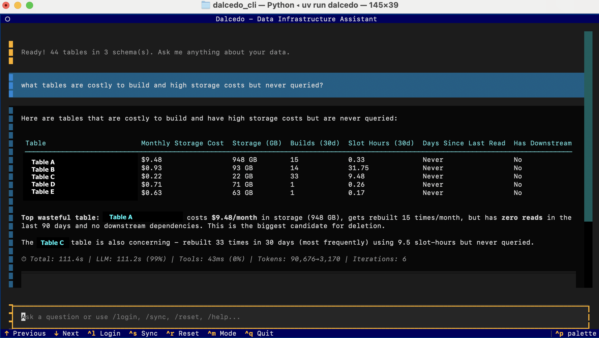

# Dalcedo TUI

A terminal-based natural language interface for querying your data metadata in BigQuery.



Plugin example:
- [BigQuery Ops](https://github.com/xDalcedo/bigquery-ops)

## What is Dalcedo TUI?

Dalcedo lets you ask questions about your data tables, schemas, and data lineage in plain English—no SQL required. The initial goal is to reduce friction when querying BigQuery metadata, but the TUI could be used with any dataset.

## Who is this for?

Dalcedo is built for **data engineers** who:
- Need to explore data metadata (costs, performances) without writing SQL every time
- Prefer working in the terminal over clicking through cloud consoles
- Want to query across multiple data sources from a single interface

## Getting Started

Get up and running in under 20 minutes.

### Prerequisites

- Python 3.11+
- [uv](https://docs.astral.sh/uv/) package manager
- A data source to connect to (e.g., BigQuery project with datasets)
- An API key for your LLM provider (Anthropic, OpenAI, or Google AI)

### Installation

```bash
# Clone the repository
git clone https://github.com/xDalcedo/dalcedo-tui
cd dalcedo_tui

# Install with uv
uv sync
```

### Configuration

1. **Launch Dalcedo:**
   ```bash
   uv run dalcedo
   ```

2. **Run `/login` to configure:**
   - Select your LLM provider (Anthropic, OpenAI, or Google Gemini)
   - Enter your API key
   - Add one or more data source plugins (see below)

3. **Run `/sync` to sync your data:**
   - Select which plugins to sync.
    - Not sure which plugin? Try the [BigQuery Ops](https://github.com/xDalcedo/bigquery-ops) DBT project.
   - Wait for the sync to complete

4. **Start asking questions!**

### Adding Data Source Plugins

Each plugin represents a connection to a data source. Plugins sync to their own DuckDB schema namespace, allowing you to query across multiple sources.

In `/login`, click **"+ Add Plugin"** and configure:

| Field | Description |
|-------|-------------|
| Plugin Name | A friendly name (e.g., `analytics`, `dbt_tests`). Becomes the DuckDB schema name. |
| Connector Type | The data source type (e.g., BigQuery) |
| Connector Settings | Connection details specific to the connector |

**Example: BigQuery Plugin**
- **Plugin Name**: `analytics`
- **Project ID**: `my-gcp-project`
- **Dataset**: `analytics_dataset`
- **Service Account JSON** (optional): `/path/to/credentials.json`
- **DBT Schema Files** (optional): `/path/to/schema.yml`

After syncing, tables are accessible as `analytics.table_name`.

### DBT Integration

To include table and column descriptions from your dbt project:

1. When adding/editing a BigQuery plugin, find the **"DBT Schema Files"** field
2. Enter comma-separated paths to your `schema.yml` files:
   ```
   /path/to/models/schema.yml, /path/to/staging/schema.yml
   ```

The AI agent will use these descriptions to better understand your data model.

## Example Queries

Once configured, try asking:

```
What tables are available?
```

```
Show me the schema for the orders table
```

```
How many columns does the users table have and what are their types?
```

```
Which tables have a customer_id column?
```

```
What's the relationship between orders and customers?
```

**Cross-schema queries** (with multiple plugins):

```
What tables are in the analytics schema?
```

```
Join users from analytics with test_results from dbt_tests
```

## How It Works

```
┌─────────────────────────────────────────────────────────────┐
│                     Dalcedo CLI (TUI)                       │
│                                                             │
│  ┌─────────────┐    ┌─────────────┐    ┌─────────────────┐ │
│  │  Your       │    │   Claude/   │    │   Local DuckDB  │ │
│  │  Question   │───▶│   GPT-4     │───▶│   ┌───────────┐ │ │
│  │             │    │   Agent     │    │   │ analytics │ │ │
│  └─────────────┘    └─────────────┘    │   │ dbt_tests │ │ │
│                            │           │   │ ...       │ │ │
│                            │  SQL      │   └───────────┘ │ │
│                            └───────────┴─────────────────┘ │
└─────────────────────────────────────────────────────────────┘
                                    ▲
                                    │ /sync (per plugin)
                    ┌───────────────┼───────────────┐
                    │               │               │
             ┌──────┴──────┐ ┌──────┴──────┐ ┌──────┴──────┐
             │  BigQuery   │ │  BigQuery   │ │   Future    │
             │  Dataset 1  │ │  Dataset 2  │ │  Connectors │
             └─────────────┘ └─────────────┘ └─────────────┘
```

**Architecture overview:**

1. **Multi-Plugin System**: Configure multiple data source plugins. Each plugin syncs to its own DuckDB schema namespace (e.g., `analytics.users`, `dbt_tests.results`).

2. **Sync Phase**: `/sync` lets you select which plugins to sync. Data is pulled into the local DuckDB database for fast, offline queries.

3. **Query Phase**: When you ask a question, an AI agent (Claude, GPT-4, or Gemini) analyzes your question, generates SQL, and executes it against the local DuckDB cache.

4. **Agentic Approach**: The agent can execute multiple queries, inspect schemas, and retry failed queries (up to 2 attempts) to find the right answer.

5. **dbt Integration**: If you provide paths to dbt `schema.yml` files, table and column descriptions are included in the AI's context for better answers.

**Key technologies:**
- **Textual** - Terminal UI framework
- **DuckDB** - Local SQL database for caching (with schema namespaces per plugin)
- **Anthropic Claude / OpenAI GPT / Google Gemini** - LLM providers for natural language understanding
- **google-cloud-bigquery** - BigQuery API client

## Commands

| Command | Description |
|---------|-------------|
| `/login` | Configure LLM credentials and data source plugins |
| `/sync` | Sync selected plugins to local cache |
| `/reset` | Clear conversation history |
| `/tables` | List all synced tables (schema-qualified) |
| `/schema` | Show database schema |
| `/mode` | Show current response mode |
| `/mode quick` | Fast, concise responses (default) |
| `/mode analytics` | Detailed analysis and reports |
| `/context` | Show custom context |
| `/context <text>` | Set custom context (domain knowledge, terminology) |
| `/context clear` | Clear custom context |
| `/traces` | Show recent traces (last 5) |
| `/traces N` | Show last N traces |
| `/usage` | Show token usage (daily/weekly) |
| `/help` | Show help message |

## Keyboard Shortcuts

| Shortcut | Action |
|----------|--------|
| `Ctrl+L` | Open login screen |
| `Ctrl+S` | Open sync screen |
| `Ctrl+R` | Reset conversation |
| `Ctrl+M` | Toggle between quick/analytics mode |
| `Up/Down` | Navigate input history |
| `Shift+Click+Drag` | Select text for copying |
| `Ctrl+C` | Copy selected text |

## Features

### Response Modes

Dalcedo TUI supports two response modes optimized for different use cases:

| Mode | Description | Max Iterations |
|------|-------------|----------------|
| **Quick** (default) | Fast, concise responses. Best for simple lookups and direct questions. | 10 |
| **Analytics** | Detailed analysis and comprehensive reports. Best for complex questions requiring multiple queries. | 20 |

Toggle with `/mode quick`, `/mode analytics`, or `Ctrl+M`.

### Custom Context

Add domain knowledge that the AI will use when answering questions:

```
/context A DBT model is a SQL transformation that defines how raw data should be transformed.
Models are organized in the 'models' directory. Our "active users" metric counts users
who logged in within the last 30 days.
```

Useful for:
- Domain terminology and business definitions
- Company-specific naming conventions
- Data relationships not obvious from the schema
- Business rules and metric definitions

Custom context is saved to your config and persists across sessions.

### Performance Monitoring

After each response, Dalcedo shows timing and token usage:

```
⏱ Total: 2.3s | LLM: 1.8s (78%) | Tools: 0.5s (22%) | Tokens: 1,234→567 | Iterations: 3
```

- **Total**: End-to-end response time
- **LLM**: Time spent waiting for the LLM API
- **Tools**: Time spent executing SQL queries and other tools
- **Tokens**: Input → Output token counts
- **Iterations**: Number of agent iterations (tool calls)

### Structured Tracing

Dalcedo TUI logs detailed traces of agent execution to `~/.cache/dalcedo/traces.jsonl` for debugging and analysis.

**View recent traces:**
```
/traces      # Show last 5 traces
/traces 10   # Show last 10 traces
```

**Trace events captured:**
- `trace_start` - Question, timestamp, trace_id
- `iteration_start` - Iteration number, mode
- `llm_call` - Duration, tokens, stop_reason, tool_calls
- `tool_call` - Tool name, args, duration, row_count, errors
- `trace_end` - Total timing, token summary, error status

**Example trace output:**
```json
{"timestamp": "2024-02-14T10:30:00", "trace_id": "a1b2c3d4e5f6", "event_type": "trace_start", "question": "How many users signed up last week?"}
{"timestamp": "2024-02-14T10:30:01", "trace_id": "a1b2c3d4e5f6", "event_type": "llm_call", "iteration": 1, "duration_ms": 850, "input_tokens": 1200, "output_tokens": 150, "stop_reason": "tool_use", "tool_calls": ["execute_sql"]}
{"timestamp": "2024-02-14T10:30:01", "trace_id": "a1b2c3d4e5f6", "event_type": "tool_call", "iteration": 1, "tool_name": "execute_sql", "duration_ms": 120, "row_count": 1}
{"timestamp": "2024-02-14T10:30:02", "trace_id": "a1b2c3d4e5f6", "event_type": "trace_end", "total_ms": 1500, "llm_ms": 1200, "tool_ms": 120, "iterations": 2, "input_tokens": 2400, "output_tokens": 300}
```

**Analyzing traces from the command line:**
```bash
# View all traces (requires jq)
cat ~/.cache/dalcedo/traces.jsonl | jq .

# Filter by trace_id
grep "a1b2c3" ~/.cache/dalcedo/traces.jsonl | jq .

# Find slow LLM calls (>2 seconds)
cat ~/.cache/dalcedo/traces.jsonl | jq 'select(.event_type == "llm_call" and .duration_ms > 2000)'

# Find failed tool calls
cat ~/.cache/dalcedo/traces.jsonl | jq 'select(.event_type == "tool_call" and .is_error == true)'

# Summary of recent traces
cat ~/.cache/dalcedo/traces.jsonl | jq 'select(.event_type == "trace_end") | {trace_id, total_ms, iterations, tokens: "\(.input_tokens)→\(.output_tokens)", error}'
```

### Token Usage & Limits

Track your LLM token usage and set limits to control costs.

**View usage:**
```
/usage
```

Output:
```
Token Usage

Today: 15,234 tokens (12,000 in / 3,234 out) — 15.2% of 100,000 limit
This week: 45,678 tokens (38,000 in / 7,678 out) — 9.1% of 500,000 limit
```

**Configure limits in /login:**
- **Daily limit**: Maximum tokens per day (e.g., 100000)
- **Weekly limit**: Maximum tokens per week (e.g., 500000)
- Leave empty for unlimited

When a limit is reached, queries are blocked until the period resets (daily at midnight, weekly on Monday).

### Error Handling

Dalcedo TUI gracefully handles common LLM API errors:

| Error | Behavior |
|-------|----------|
| Rate limit | Shows retry time if available |
| Quota exceeded | Suggests checking billing |
| Authentication | Prompts to update API key via `/login` |
| Connection error | Shows connectivity message |
| Internal server error | Shows request ID for support |

## Configuration Files

Dalcedo stores configuration in XDG-compliant directories:

| Type | Location | Contents |
|------|----------|----------|
| Config | `~/.config/dalcedo/config.toml` | Plugins, LLM settings |
| Credentials | `~/.local/share/dalcedo/credentials.json` | API keys (chmod 600) |
| Cache | `~/.cache/dalcedo/local.duckdb` | Local DuckDB database |

**Example config.toml:**
```toml
[llm]
provider = "anthropic"

[limits]
daily_tokens = 100000
weekly_tokens = 500000

[context]
custom = "A DBT model is a SQL transformation. Active users = logged in within 30 days."

[[connections]]
id = "abc123"
name = "Production BigQuery"
type = "bigquery"

[connections.config]
project_id = "my-gcp-project"
location = "US"

[[plugins]]
id = "def456"
name = "analytics"
connection_id = "abc123"
enabled = true

[plugins.source]
dataset_id = "analytics_dataset"
dbt_schema_paths = "/path/to/schema.yml"

[[plugins]]
id = "ghi789"
name = "dbt_tests"
connection_id = "abc123"
enabled = true

[plugins.source]
dataset_id = "test_results"
```

## Adding Custom Connectors

Developers can add new data source connectors by creating a class that extends `BaseConnector`.

**1. Create a new connector file:**

```python
# src/dalcedo/connectors/snowflake.py
from dalcedo.connectors.base import BaseConnector, ConnectorField, SyncUpdate
from dalcedo.connectors.registry import register_connector

@register_connector
class SnowflakeConnector(BaseConnector):
    name = "snowflake"           # Internal identifier
    display_name = "Snowflake"   # Shown in UI
    description = "Connect to Snowflake warehouse"

    @classmethod
    def get_config_fields(cls) -> list[ConnectorField]:
        """Define configuration fields for the UI."""
        return [
            ConnectorField(
                name="account",
                label="Account",
                placeholder="xy12345.us-east-1",
                required=True,
            ),
            ConnectorField(
                name="warehouse",
                label="Warehouse",
                placeholder="COMPUTE_WH",
                required=True,
            ),
            ConnectorField(
                name="database",
                label="Database",
                required=True,
            ),
            ConnectorField(
                name="password",
                label="Password",
                field_type="password",
                required=True,
            ),
        ]

    async def test_connection(self) -> bool:
        """Test the connection. Raise exception on failure."""
        # Your connection test logic
        pass

    def sync(self, db, schema_name="main"):
        """Sync data to DuckDB. Yield SyncUpdate for progress."""
        db.create_schema(schema_name)

        yield SyncUpdate("Connecting...", 0.0, schema_name=schema_name)

        # Sync tables...
        for table in tables:
            yield SyncUpdate(f"Syncing {table}...", progress, table, schema_name)
            arrow_data = self.fetch_table(table)
            db.create_table_from_arrow(table, arrow_data, schema_name=schema_name)

        yield SyncUpdate("Complete!", 1.0, schema_name=schema_name)

    def get_schema_context(self, db) -> str:
        """Return schema description for LLM context."""
        return db.get_schema_description()
```

**2. Register the connector in `registry.py`:**

```python
def load_builtin_connectors() -> None:
    from dalcedo.connectors import bigquery  # noqa: F401
    from dalcedo.connectors import snowflake  # noqa: F401  # Add this
```

**ConnectorField options:**
| Field | Description |
|-------|-------------|
| `name` | Config key name |
| `label` | Display label in UI |
| `field_type` | `"text"`, `"password"`, `"file"`, or `"select"` |
| `placeholder` | Input placeholder text |
| `required` | Whether the field is required |
| `default` | Default value |
| `options` | For select fields: `[("Display", "value"), ...]` |

## Running Tests

```bash
uv run pytest tests/ -v
```

## Get Help

- **Issues**: [GitHub Issues](https://github.com/xDalcedo/dalcedo-tui/issues)
- **Email**: matthieu@freeldom.com

## License

MIT
